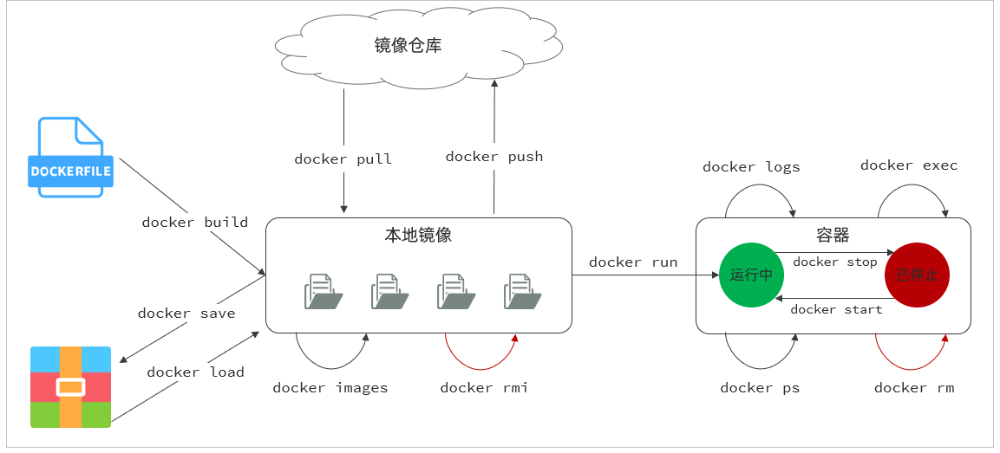
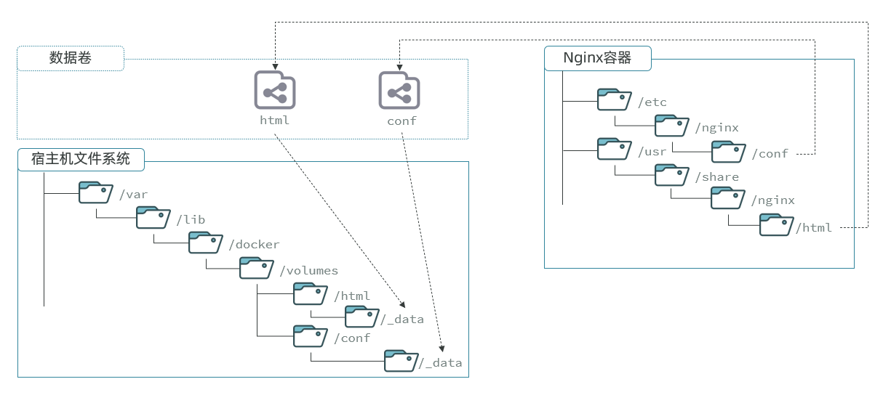

## 常见命令
### 命令介绍
比较常见的命令有：

| 命令           | 说明                           |
| :------------- | ------------------------------ |
| docker pull    | 拉取镜像                       |
| docker push    | 推送镜像到Docker Registry      |
| docker images  | 查看本地镜像                   |
| docker rmi     | 删除本地镜像                   |
| docker run     | 创建并运行容器（不能重复创建） |
| docker stop    | 停止指定容器                   |
| docker start   | 启动指定容器                   |
| docker restart | 重新启动容器                   |
| docker rm      | 删除指定容器                   |
| docker ps      | 查看容器                       |
| docker logs    | 查看容器运行日志               |
| docker exec    | 进入容器                       |
| docker save    | 保存镜像到本地压缩文件         |
| docker load    | 加载本地压缩文件到镜像         |
| docker inspect | 查看容器详细信息               |

用一张图表示这些容器之间的关系：  


## 数据卷
数据卷（volume）是一个虚拟目录，是容器内目录与宿主机目录之间映射的桥梁。  
以nginx为例，我们知道Nginx中有两个关键的目录：   
- `html`：放置一些静态文件  
- `config`：放置配置文件  
如果我们要让Nginx代理我们的静态资源，最好是放到`html`目录；如果我们要修改Nginx的配置，最好是找到`conf`下的`nginx.conf`文件。  
但遗憾的是，容器运行的Nginx文件都在容器内部。所以我们必须利用数据卷将两个目录与宿主机目录关联，方便我们操作。

如图：  


在上图中：
- 我们创建了两个数据卷：`conf`、`html`
- Nginx容器内部的`conf`目录和`html`目录分别与两个数据卷关联
- 而数据卷conf和html分别指向了宿主机的  
	`/var/lib/docker/volumes/conf/_data`目录和  
	`/var/lib/docker/volumes/html/_data`目录

这样一来，容器内的`conf`和`html`目录就 与宿主机的`conf`和`html`目录关联起来，我们称之为**挂载**。

此时，我们操作宿主机的`/var/lib/docker/volumes/html/_data`就是在操作容器内的`/user/share/nginx/html/_data`目录。只要我们将静态资源放入宿主机对应目录，就可以被nginx代理了。

> [!小提示]
> `/var/lib/docker/volumes`这个目录就是默认的存放所有容器数据卷的目录，其下再根据数据卷名称创建新目录，格式为`/数据卷名/_data`。  </br></br>
> **为什么不让容器目录直接指向宿主机目录呢**？
> - 因为直接指向宿主机目录就与宿主机强耦合了，如果切换了环境，宿主机目录就可能发生改变了。由于容器一旦创建，目录挂载就无法修改，这样容器就无法正常工作了。
> - 但是容器指向数据卷，一个逻辑名称，而数据卷再指向宿主机目录，就不存在强耦合。如果宿主机目录发生改变，只要改变数据卷与宿主机目录之间的映射关系即可。  </br></br>
> 不过，我们通过由于数据卷目录比较深，不好寻找，通常我们也**允许让容器直接与宿主机目录挂载而不使用数据卷**，具体参考2.2.3小节。

### 命令
数据卷相关命令有：

| 命令                  | 说明                 |
| :-------------------- | -------------------- |
| docker volume create  | 创建数据卷           |
| docker volume ls      | 查看所有数据卷       |
| docker volume rm      | 删除指定数据卷       |
| docker volume inspect | 查看某个数据卷的详情 |
| docker volume prune   | 清除数据卷           |

注意：容器与数据卷的挂载要在创建容器时配置，对于创建好的容器，是不能设置数据卷的。而且创建容器的过程中，数据卷会自动创建。

nginx的html目录挂载：
```powershell
# 1.首先创建容器并指定数据卷，注意通过 -v 参数来指定数据卷
docker run -d --name nginx -p 80:80 -v html:/usr/share/nginx/html nginx:1.20.2

# 2.然后查看数据卷
docker volume ls


# 3.查看数据卷详情
docker volume inspect html


# 4.查看/var/lib/docker/volumes/html/_data目录
ls -l /var/lib/docker/volumes/html/_data


# 5.进入该目录，并随意修改index.html内容
cd /var/lib/docker/volumes/html/_data
vi index.html

# 6.打开页面，查看效果

# 7.进入容器内部，查看/usr/share/nginx/html目录内的文件是否变化
docker exec -it nginx bash
```